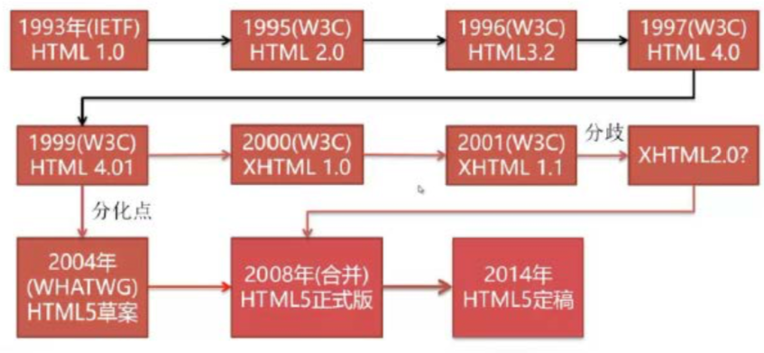
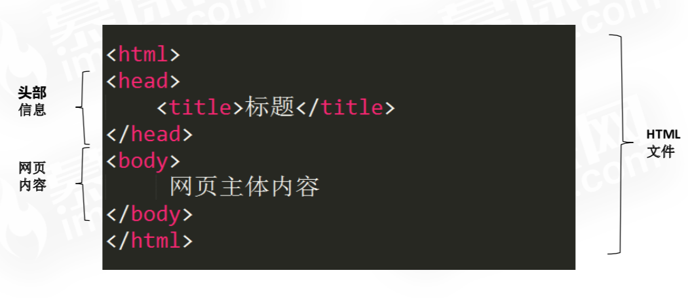
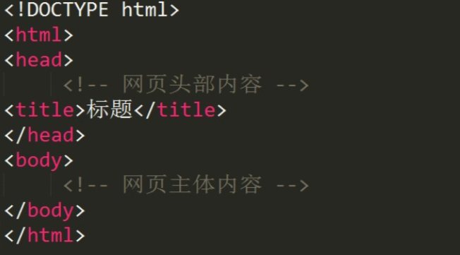

# HTML基础
## HTML概念
HTML(Hypertext Markup Language)即超文本标记语言

##HTML发展史

## HTML特点
* HTML不需要编译，直接由浏览器执行
* HTML文件是一个文本文件
* HTML文件必须使用html或者htm为文件名后缀 
* HTML大小写不敏感，HTML和html一样

#HTML基础语法
##HTML基本机构

##HTML标签
* 语法: <标签名> </标签名> 
* 例如: &lt;html&gt;....&lt;/html&gt;
* 规范 
	 1. <和>括起来
	 2. 一般成对出现，分开始标签和结束标签。结束标签比开始标签多了一个/
	 3. 单标签:没有结束标签 &lt;hr/&gt;

##HTML标签属性
* 语法:<标签名 属性名1="值" 属性名2="值" ... > ..... </标签名>

##HTML注释
* &lt;!--这里是注释--&gt;
* 注释在网页中不显示。

##DOCTYPE 文档类型声明
* <!DOCTYPE> 声明必须放在HTML文档第一行。 
* <!DOCTYPE> 声明不是HTML标签

##网页编码设置
当网页显示出现乱码时，在&lt;head&gt;&lt;/head&gt;标签之间添加:
`<meta http-equiv=“Content-Type” content=“text/html;charset=utf-8”/>`
注:utf-8、GB2312、gbk等编码
##文字和段落标签
* 标题标签: &lt;h1&gt;&lt;/h1&gt;~&lt;h6&gt;&lt;/h6&gt; 
* 段落标签: &lt;p&gt; &lt;/p&gt; 
* align对齐属性值

	|  值 | 描述 | 
	|:-----|:-----|
	|left |  左对齐内容  |
	|right  |  右对齐内容  |   
	|center |  居中对齐内容  | 
	|justify |  对行进行伸展，这样每行都可以有相等的长度  |
	
* 换行标签: &lt;br/&gt; 	
* 水平线: &lt;hr/&gt; 属性如下：

	|  属性 | 描述 | 
	|:-----|:-----|
	|width |  设置水平线宽度，可以像素或百分比  |
	|color  |  设置水平线颜色  |   
	|algin |  设置水平线居中对齐  | 
	|noshade |  设置水平线无阴影  |
	
* 文字斜体:&lt;i&gt;&lt;/i&gt; 、 &lt;em&gt;&lt;/em&gt; 
* 加粗:&lt;b&gt;&lt;/b&gt; 、&lt;strong&gt;&lt;/strong&gt; 
* 下标:&lt;sub&gt;
* 上标:&lt;sup&gt;
* 插入内容:&lt;ins&gt; 
* 删除内容:&lt;del&gt;
##特殊符号
|  属性 | 显示结果 |  描述 |
|:-----|:-----:|:-----|
|`&lt;` |  <  |   小于号或显示标记  |
|`&gt;`  |  >  |   大于号或显示标记  |
|`&gt;` |  ®  |   已注册  |
|`&copy;` |  ©  |   版权  |
|`&trade;` |  &trade;  |   商标 |
|`&nbsp;` |  Space  |   不断行的空白  |

#列表标签
##列表标签
* 无序列表： 
 `<ul><li>列表项</li> <li>列表项</li>......</ul>`
* 有序列表： 
`<ol><li>列表项</li> <li>列表项</li>......</ol>`
* 定义列表:
 `<dl>
		<dt>定义列表项</dt> 
		<dd>列表项描述</dd> 
		<dd>列表项描述</dd> 
		<dt>定义列表项</dt> 
		<dd>列表项描述</dd>
	</dl>`
	
##图像标签
* 语法： ``
 
##超链接标签
* 语法： `< a href=“”>内容</a>`

|  属性 | 描述 | 
|:-----|:-----|
|href |  链接地址  |
|target  |  链接的目标窗口`_self,_blank,_top,_parent`|   
|title |  链接提示文字  | 
|name |  链接命名  |
* 定义锚（自行查阅资料）
* 电子邮件链接:
 `< a href=“mailto:邮件地址”>......</a>`